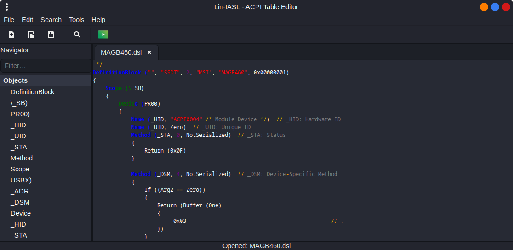

# Lin-IASL - ACPI Table Editor for Linux [](https://opensource.org/licenses/MIT)

A modern GTK3-based graphical editor for ACPI (Advanced Configuration and Power Interface) source code and tables. Provides decompilation, compilation, and extraction of ACPI tables from system firmware.

> The tool is currently 80% complete and still under development.

## Features

- **Multi-tab Editor**: Work with multiple ASL/DSL files simultaneously
- **Syntax Highlighting**: Color-coded highlighting for ASL keywords, strings, comments, numbers, and operators
- **Navigator Panel**: Left-side panel showing ACPI objects (DefinitionBlock, Device, Method, Scope, etc.) with filter capability
- **ACPI Compilation**: Compile ASL/DSL source to AML bytecode using the iasl compiler
- **ACPI Decompilation**: Decompile AML files back to ASL/DSL source
- **Extract ACPI Tables**: Extract ACPI tables directly from system firmware (`/sys/firmware/acpi/tables`)
- **Search & Replace**: Find and replace text with options for case sensitivity, regex, and whole word matching
- **Theme Support**: Toggle between dark and light editor themes
- **Line Numbers**: Optional line number display (when GtkSource is available)
- **Keyboard Shortcuts**: Standard shortcuts (Ctrl+S save, Ctrl+O open, Ctrl+F find, etc.)

## Screenshot



## Quick Start

```bash
git clone https://github.com/mohdismailmatasin/lin-iasl.git
cd lin-iasl
python3 run.py
```

Or open a specific ACPI file:

```bash
python3 run.py <your-file>.dsl
```

## Requirements

- Python 3.8+
- PyGObject
- GTK 3.0
- iasl (acpica/acpica-tools) - for compilation/decompilation

Install dependencies on Debian/Ubuntu:

```bash
sudo apt install python3-gi gir1.2-gtksource-3.0 acpica-tools
```

## Usage

### Opening Files

- **File > Open**: Open a single ASL/DSL or AML file
- **File > Open Directory**: Open all ACPI files from a directory
- When opening AML files, they are automatically decompiled to DSL

### Editing

- Standard text editing operations (cut, copy, paste, undo, redo)
- Multiple tabs for working with several files
- Modified files are tracked with visual indicators

### ACPI Operations

- **Tools > Compile**: Compile current ASL/DSL to AML
- **Tools > Decompile**: Decompile AML to DSL
- **Tools > Extract ACPI Tables**: Extract tables from system firmware to the `ACPI/` directory

### Navigation

- Use the Navigator panel to see all ACPI objects in the file
- Filter objects by typing in the filter box
- Click an object to jump to its location in the editor

### Search

- **Search > Find** (Ctrl+F): Find text with case sensitivity, regex, and whole word options
- **Search > Replace** (Ctrl+H): Find and replace text, with support for replace all

## Keyboard Shortcuts

| Shortcut | Action |
|----------|--------|
| Ctrl+N | New file |
| Ctrl+O | Open file |
| Ctrl+S | Save file |
| Ctrl+Shift+S | Save As |
| Ctrl+W | Close tab |
| Ctrl+Q | Quit |
| Ctrl+F | Find |
| Ctrl+H | Replace |
| Ctrl+B | Compile |
| Ctrl+Z | Undo |
| Ctrl+Y | Redo |

## Project Structure

```
lin-iasl/
├── run.py                 # Entry point for running without installation
├── setup.py               # Package setup configuration
├── LICENSE                # MIT License
├── lin-iasl.png           # Application screenshot
├── src/
│   └── lin_iasl/
│       ├── __init__.py    # Package initialization
│       ├── main.py        # Main window and application entry
│       ├── window.py      # Main window UI implementation
│       ├── tabs.py        # Tab management and syntax highlighting
│       ├── search.py      # Search and replace functionality
│       └── dialogs.py     # Dialog windows (about, error)
└── tests/
    └── test_main.py       # Unit tests
```

## License

MIT License - See LICENSE file for details.

## Contributing

Contributions are welcome! Whether you want to:

- Report bugs
- Suggest new features
- Improve documentation
- Submit pull requests

Feel free to fork the repository and submit your contributions.
